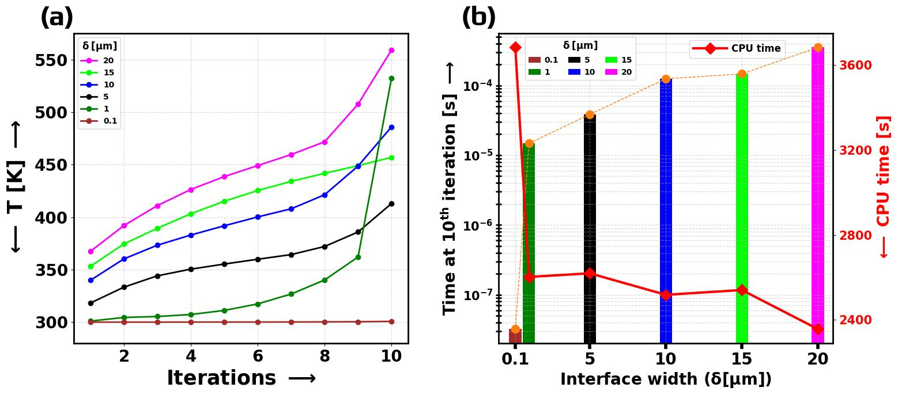

# Spatiotemporally learning the morphological and dynamic features of Au melt pool under different heat source types with phase-field informed U-Net framework

## Effect of interface width on Numerical Convergence

### For 10 iterations:
#### CPU clock time for convergence
Longest time at delta = 1 micro-meter
Fasters at delta = 20 micro-meter

#### Actual Simulation Time after 10 iterations
delta of 1 micro-meter is stuck at 4 order of magnitude less than delta of 20 micro-meter

#### Maximum temperature reached after 10 iterations
T-max for delta @ 1 micro-meters after 10 iterations = 300.75 K
T-max for delta @ 20 micro-meters after 10 iterations = 559.14 K
