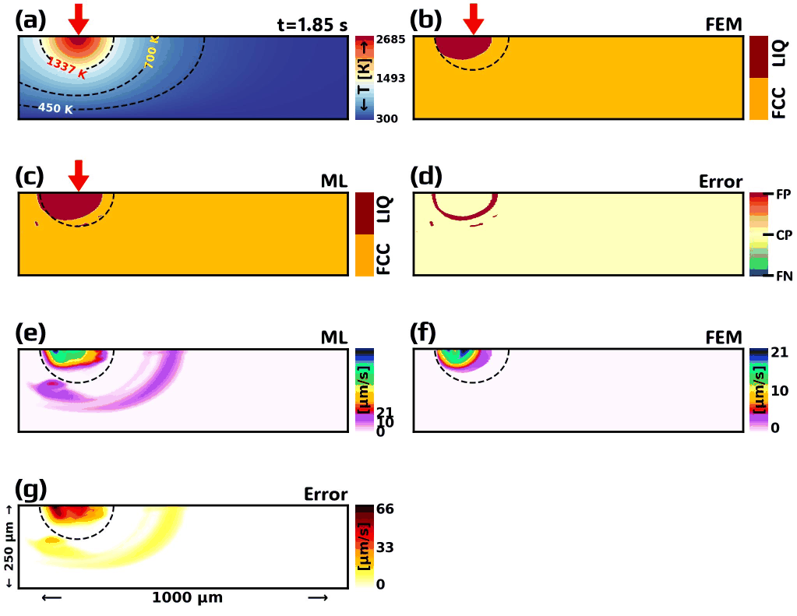

# A robust phase-field U-net framework to digitally identify the melt pools from different heat source models in real time.

[Upadesh Subedi](https://www.linkedin.com/in/upadesh-s-0b321a15b/)
<!-- 
,
[Aadya Bhattarai](https://www.linkedin.com/in/aadya-bhattarai-706769194/),
[Nele Moelans](https://www.linkedin.com/in/nele-moelans-57b1731/),
[Tomasz Tański](https://www.linkedin.com/in/tomasz-tanski-888bb266/),
[Anil Kunwar](https://www.linkedin.com/in/anil-kunwar-9ba81653/)
 -->

<!-- ## Phase Evolution
### Bessel Heat Source with TDB Free Energy
#### Phase Evolution

#### Temperature Distribution

#### Velocity Profile
 -->

# Digital Twin Design
## Interactive Digital Twin Demo Streamlit WebApp : 

# Free Energy Expression from Direct TDB file
## Thermal History

<table>
  <tr>
    <td>
      <strong>Video A1 | Gaussian HS | TDB Free Energy </strong> 
      
    </td>
    <td>
      <strong>Video A2 | Flat-Top HS | TDB Free Energy</strong> 
      
    </td>
  </tr>
  <tr>
    <td>
      <strong>Video A3 | Ring HS | TDB Free Energy</strong> 
      
    </td>
    <td>
      <strong>Video A4 | Bessel HS | TDB Free Energy</strong> 
      
    </td>
  </tr>
</table>

## Phase Evolution

<table>
  <tr>
    <td>
      <strong>Video A5 | Gaussian HS | TDB Free Energy </strong> 
      
    </td>
    <td>
      <strong>Video A6 | Flat-Top HS | TDB Free Energy</strong> 
      
    </td>
  </tr>
  <tr>
    <td>
      <strong>Video A7 | Ring HS | TDB Free Energy</strong> 
      
    </td>
    <td>
      <strong>Video A8 | Bessel HS | TDB Free Energy</strong> 
      
    </td>
  </tr>
</table>

## Velocity Profile

<table>
  <tr>
    <td>
      <strong>Video A9 | Gaussian HS | TDB Free Energy </strong> 
      
    </td>
    <td>
      <strong>Video A10 | Flat-Top HS | TDB Free Energy</strong> 
      
    </td>
  </tr>
  <tr>
    <td>
      <strong>Video A11 | Ring HS | TDB Free Energy</strong> 
      
    </td>
    <td>
      <strong>Video A12 | Bessel HS | TDB Free Energy</strong> 
      
    </td>
  </tr>
</table>

# Free Energy Expression via Fitting or Fine-Tuned approximation
## Thermal History

<table>
  <tr>
    <td>
      <strong>Video A13 | Gaussian HS | TDB Free Energy </strong> 
      
    </td>
    <td>
      <strong>Video A14 | Flat-Top HS | TDB Free Energy</strong> 
      
    </td>
  </tr>
  <tr>
    <td>
      <strong>Video A15 | Ring HS | TDB Free Energy</strong> 
      
    </td>
    <td>
      <strong>Video A16 | Bessel HS | TDB Free Energy</strong> 
      
    </td>
  </tr>
</table>

## Phase Evolution

<table>
  <tr>
    <td>
      <strong>Video A17 | Gaussian HS | TDB Free Energy </strong> 
      
    </td>
    <td>
      <strong>Video A18 | Flat-Top HS | TDB Free Energy</strong> 
      
    </td>
  </tr>
  <tr>
    <td>
      <strong>Video A19 | Ring HS | TDB Free Energy</strong> 
      
    </td>
    <td>
      <strong>Video A20 | Bessel HS | TDB Free Energy</strong> 
      
    </td>
  </tr>
</table>

## Velocity Profile

<table>
  <tr>
    <td>
      <strong>Video A21 | Gaussian HS | TDB Free Energy </strong> 
      
    </td>
    <td>
      <strong>Video A22 | Flat-Top HS | TDB Free Energy</strong> 
      
    </td>
  </tr>
  <tr>
    <td>
      <strong>Video A23 | Ring HS | TDB Free Energy</strong> 
      
    </td>
    <td>
      <strong>Video A24 | Bessel HS | TDB Free Energy</strong> 
      
    </td>
  </tr>
</table>

## Machine Learning Model Prediction

<table>
  <tr>
    <td>
      <strong>Machine Learning | Phase-Field | FEM </strong> 
      
      <strong>FN: False Negative | CP: Correct Prediction | FP: False Positive </strong> 
    </td>
  </tr>
</table>